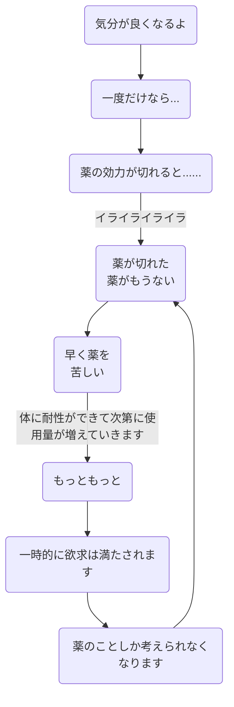

<!--
**satoHBSS/satoHBSS** is a ✨ _special_ ✨ repository because its `README.md` (this file) appears on your GitHub profile.

Here are some ideas to get you started:

- 🔭 I’m currently working on ...
- 🌱 I’m currently learning ...
- 👯 I’m looking to collaborate on ...
- 🤔 I’m looking for help with ...
- 💬 Ask me about ...
- 📫 How to reach me: ...
- 😄 Pronouns: ...
- ⚡ Fun fact: ...
-->



```mermaid
gantt
  excludes weekends

  task1 :done,   a1, 2022-01-03, 3d
  task2    :active, a2, after a1,   3d
  task3    :        a3, after a2,   1d
  ```
